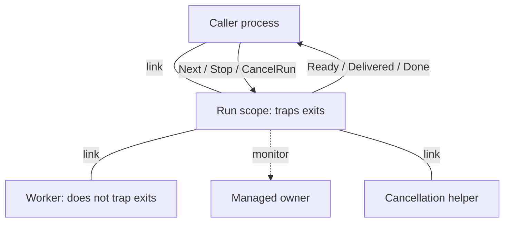

# Weft architecture

Weft owns transient work in a scope process and supplies typed receive loops
for actors, state machines and event managers. The public builders describe
work; the process that starts or hosts that work owns the mailbox. This guide
is for a programmer comfortable with concurrency who is learning the Gleam
source. Start with [the reading guide](reading-guide.md) for language patterns
and the order in which to read the modules.

## Ownership boundaries

The run engine in [`src/weft.gleam`](../src/weft.gleam) creates one linked
scope per run. The scope traps exits, and its workers are linked to the scope.
A worker report and that worker's exit are separate facts: a report supplies
an outcome, while the exit releases the scope's obligation to join that
process. `Scope.running` contains workers that still owe an outcome;
`Scope.finishing` contains workers that answered but have not yet exited.
`settled` checks both lists before `finish` can end the scope.

A managed owner belongs to the work's lifecycle, not necessarily to the
scope's supervision tree. The scope monitors it and stores its cancellation
closure. `adopt_owners` installs monitors before workers can start; for local
owners, `sys.deliver_signals` waits for that monitor signal to arrive before
another process can release the owner's work. `adopt_published` uses the same
barrier before replying `Adopted` or `Refused`. The remote-pid branch of the
barrier returns `True` without a local `process_info` barrier; it does not
supply the same local delivery observation.

`prepared_task` declares a transitive owner: only a normal exit proves its
subtree drained. `prepared_leaf` declares an owner with no descendants, so
any exit resolves drain after admission. A prepared owner already dead at
adoption gets `ProofAbsent`, and its later DOWN produces `ProofLost` for
either role. Dynamic adoption starts at `ProofPending` and judges the exit by
role even when the owner was already dead. These are distinct contracts,
implemented by `adopt_owners`, `adopt_published`, `judge_exit` and `judge_role`.

## One run, from admission to delivery

`start` and `fold` call `drive`. `drive` creates the reply subject in the
caller, spawns `run_scope`, and consumes replies through `consume`.
`start_detached` and `start_witnessed` use the same scope but finish the
`Ready` handshake in `await_ready`, allowing the caller to serve other work.
A detached handle's outbox belongs to its starting process; `pull` must run
there. A witnessed run starts with the `Discarding` consumer and publishes
its result through the scope's monitored exit rather than an outcome stream.

`run_scope` creates its own subjects and selectors, adopts prepared owners,
and enters `loop`. Each active pass calls `fill_slots`, then `deliver`, then
checks `settled`. If anything remains, the scope receives one `Event` and
passes it to `step`. Suspension changes this receive to the system selector;
run events remain queued until resume.

An occupied slot covers a spawned task until the scope delivers its sealed
outcome. `deliver` returns that slot when it sends `Delivered`, before the
caller executes its reducer. The scope can fill the released slot while the
consumer is `Busy`, but it cannot deliver again until `Next` grants demand.
Thus `limit` bounds occupied slots, with at most one additional delivered
outcome held by the consumer. The count does not bound task payload bytes,
worker heaps or the materialized input list. `finishing` separately tracks
reported workers still awaiting exit; cancellation also materializes
`NeverStarted` outcomes for pending tasks.

A worker's `Reported` event passes through `note_report` into `note_outcome`.
An owner's `WatchedDown` passes through `resolve_owner` into `apply_proof`.
Those paths meet at the task's aggregate proof. `ProofPending` or
`ProofAbsent` withholds a worker outcome in `Scope.awaiting`; a resolved
proof permits `queue_outcome`. `Scope.sealed` prevents a second owner from
writing another account entry for the same task.

| Aggregate owner fact | Worker outcome |
|---|---|
| All owners `ProofDrained`, or no owners | Keep the worker's outcome |
| At least one `ProofLost` | `DrainProofLost` |
| No loss, at least one `ProofUnconfirmed` | `CancellationUnconfirmed` |
| No loss or unconfirmed proof, some owner unresolved | Withhold outcome |

The `Consumer` transition table beside its type is the delivery protocol.
The `Proof` table beside its type is the owner protocol. Reading those tables
before `step` makes each received event's effect on the run explicit.

## Cancellation and the drain verdict

`begin_cancel` sends every worker kill before waiting for any exit. It then
uses `dispatch_cancels` to ask unresolved owners to stop, running each closure
on a linked helper. Owners are never killed by this path, because their exits
supply drain evidence. Children adopted beneath a pending parent are staged:
`dispatch_cancels` skips them until the parent's exit calls `ask_children`.

Cancellation is recorded once. Pending tasks become `NeverStarted`, with
managed proofs still applied through `note_outcome`. A worker's `Killed` exit
becomes `Abandoned` only after scope cancellation has begun; before that it
is `Crashed(Killed)`. A helper's exit is bookkeeping, and a raised cancellation
closure is logged rather than crashing the trapping scope.

Without `cancel_grace`, unresolved owners can keep the scope alive
indefinitely. With a grace, `expire_grace` demonitor-flushes pending owners,
kills their helpers, and marks `ProofUnconfirmed`. An owner may still be
alive afterward. `DrainProofLost` likewise reports missing evidence about
external descendants. A completed account alone therefore does not prove
external work stopped.

After all workers and helpers exit and all proofs resolve, `finish` sends
`Done` when a consumer remains, unlinks the caller, and terminates according
to `Verdict`. `AllDrained` returns normally; `SomeUnconfirmed` exits with
`weft_drain_unconfirmed`; `SomeLost` exits with `weft_drain_proof_lost`.
The verdict travels by monitor after the link has been removed. It lets one
scope serve as another run's owner without translating a separate protocol.
`Done` describes completion of the account; the monitored exit describes
the drain verdict.

## Actors and state machines

[`weft/actor`](../src/weft/actor.gleam) owns a loop over `Self`, user messages,
accepted timer fires and the system plane. `initialise_actor` creates or
registers the subject before custom initialization, loads the injected queue,
and acknowledges startup before `loop`. `run` handles injected messages
before receiving ordinary mailbox traffic. `poll_system` checks the system
plane between queued messages so a continue chain does not starve suspension.
`handle` applies `Continue` or `Stop`; the table beside `Next` records the
terminal paths and shutdown-callback ordering.

[`weft/state_machine`](../src/weft/state_machine.gleam) owns a sibling loop,
rather than wrapping the actor. It must decide state-timeout cancellation
and postponed-event replay between callbacks. `handle` cancels the event
timeout before invoking `on_event`; `commit` interprets the returned `Step`.
`retarget` distinguishes `Keeping` from `Moving`, but structural inequality
of the actual state value is the test for a state change. Changing only
`data`, or moving to an equal state, runs no enter callback and replays no
postponed events.

On a changed state, `changed_state` cancels the old state timer, restores
postponed events to arrival order, and applies timer actions before the enter
callback. The queue order is enter-injected messages, then event-handler
injections, then replayed postponed events, then the previously queued tail.
The mailbox follows after that queue drains. Postponing again in the new
state is legal. An enter callback returns `Enter`, whose phantom marker
prevents postponing an event it never received.

The four timeout kinds use three `TimerKey` constructors. `StateTimeout`
dies with its state, `EventTimeout` dies before the next handled event, and
`NamedTimeout(name)` survives state changes. A named timeout's `Cadence`
is `OneShot` or `Repeating`, so periodic timeouts share the same name space.
The accepted repeating fire records a pending key, and `rearm_repeating`
runs after the step's own actions. A handler that cancels the name or converts
it to `OneShot` ends the series. Rearming precedes an enter callback, which
can still cancel that timer. These are fixed delays; handler time does not
create a backlog of scheduled ticks.

Actor and machine suspension cancel live timer-book entries, retain their
configuration, and rearm full durations on resume. Their frozen selectors
accept system messages and trapped exits when trapping is enabled. The run
scope differs: it serves only the system plane while suspended and does not
freeze its deadline or grace timers. Their events wait in its mailbox.
Trapped parent death is therefore delayed until that scope resumes; an
untrappable kill still follows the link topology.

Both actor and machine starts default to a link. `unlinked` changes `start`'s
spawn choice, and `supervised` passes that builder unchanged to `start`.
Retain the linked default for a supervisor requiring linked child startup.
For trapped abnormal stops, `exit_process` uses `sys.exit_abnormal`, the stock
one-argument `erlang:exit`. A two-argument exit sent to self would become a
message under trapping and incorrectly allow a normal return.

## Shared timer and system boundaries

[`internal/timer`](../src/weft/internal/timer.gleam) is a value passed through
the owning loop, not a timer process. `set` removes an old key and assigns a
fresh generation. `accept` checks key plus generation and removes the live
entry before returning `Deliver`. A canceled, replaced or duplicated fire
becomes `Stale`. The table beside `Delivery` states all three cases.

[`weft/timer`](../src/weft/timer.gleam) exposes only `Source`. `WallClock`
returns a cancellable BEAM timer handle; `Injected(after)` supplies a wake
closure with no cancellation handle. Generation checks remain necessary on
both paths, because cancellation cannot recall a mailbox message. The
injected function runs synchronously at arming, must return promptly, and
must eventually invoke the wake for liveness. Delayed or duplicated wakes
are recognized by the same timer book.

[`internal/sys`](../src/weft/internal/sys.gleam) decodes system messages,
replies and returns the new `Plane` mode. Each owning loop controls the work
it receives and its timer policy. `sys.selecting` is merged last so a user
selector cannot shadow the debug plane. `convert_system_message` in
[`weft_sys_ffi.erl`](../src/weft_sys_ffi.erl) accepts any term and decodes the
supported `GetState`, `GetStatus`, `Suspend`, `Resume` and `ChangeCode` requests.
An opted-in suspended actor or state machine handles `ChangeCode` through
[`weft/upgrade`](../src/weft/upgrade.gleam): the existing task engine prepares
a bounded candidate, then the loop replaces state and application callbacks
together. Failure retains the original implementation. The loader owns code
verification, loading and resume; manual suspension remains manual. Run scopes
and non-opted loops answer change-code requests with an explicit refusal.
Other unsupported requests become `Unimplemented`; current loops log them rather
than answering. A tool calling an unsupported operation can therefore time
out. The Erlang boundary also supplies reply tagging, hibernation and the
local signal-delivery barrier absent from the existing bindings.

## Registry, events and foreground waits

[`weft/registry`](../src/weft/registry.gleam) gives a stable typed reference
address to a replaceable subject. Its [`internal/registry`](../src/weft/internal/registry.gleam)
owner is an upstream OTP actor, avoiding a cycle through Weft's addressed
actor builder. `bind` checks existing rows, `publish` records a monitor and
binding, and `retire` erases only the row carrying the resolving monitor.
Repeated registration of the same subject is idempotent. A dead recipient
can be replaced before its old DOWN arrives, and that DOWN cannot remove
the new row.

Readers resolve directly through ETS. Lookup validates recipient liveness,
but the recipient can die before a subsequent send; resolution acknowledges
routing, not execution. Registration timeout does not revoke a queued bind.
Stopping the namespace destroys its table and invalidates all addresses,
without stopping recipients or proving their external work drained.
[`weft_registry_ffi.erl`](../src/weft_registry_ffi.erl) supplies only the missing
ETS and local-subject operations; conflict and monitor policy stay in Gleam.

[`weft/event_manager`](../src/weft/event_manager.gleam) is an actor whose state
is an ordered list of `Handler(event)`. Each handler closes over its private
state and returns its successor. `fan_out` applies `Keep`, `RemoveSelf` or
`Failed` in add order, and `SyncNotify` replies after that traversal.
Declared failure removes one handler; a raised exception kills the manager,
and a slow handler blocks all later handlers. No per-handler process or
exception-catching FFI is implied by the typed interface.

[`weft/poll`](../src/weft/poll.gleam) owns no process. `until` and `until_on`
reduce to `fold_until`, which computes a deadline and enters one `loop`.
The first probe runs immediately; `Pending` checks the remaining budget and
clips the next sleep. A final probe still runs after sleeping to the deadline.
A blocking probe cannot be interrupted by this deadline, and a frozen
injected clock cannot expire a wait. `Clock` pairs reading and sleep on one
time base; `RanOut` retains the last probe's carried state.
