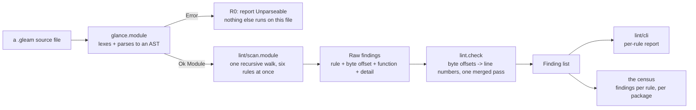
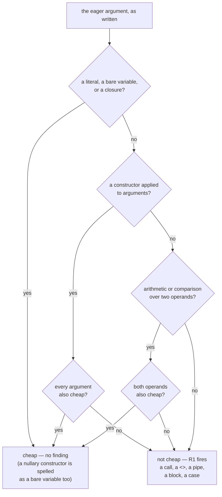
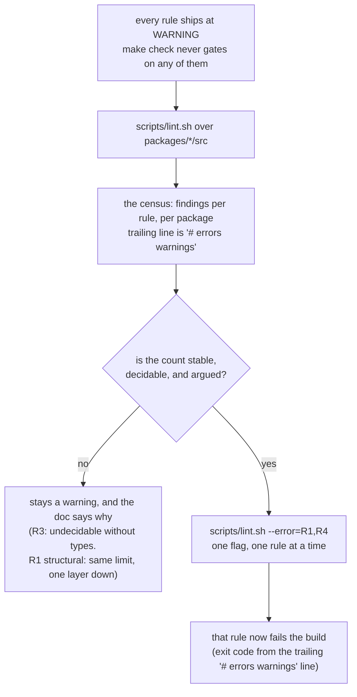

# lint

Loom's own lint: the house rules `gleam check` and `gleam format` do not
know about. Gleam ships no lint command. `gleam check` typechecks,
`gleam format` lays out — and neither has an opinion about whether an
eagerly-evaluated fallback is expensive, how deep a `case` may nest,
whether a `_ ->` arm is hiding a sibling variant, or whether `panic`
belongs in `src/`. Those rules lived in review and in prose until the
prose stopped being enough.

## Why this exists, in two commits

`08cdbce` is the origin story. A de-nesting pass flattened
`core/json.gleam`'s string parser, and in doing so wrote one guard the
eager way: its `return:` built a `CorruptionReport`, and a report carries
an excerpt of the remaining input, and the excerpt measured that input's
length to decide whether to add an ellipsis. Gleam evaluates a function's
arguments before the function runs, so that report — excerpt, length walk
and all — was constructed on *every character that parsed*, whether the
guard fired or not. Nothing was wrong on any error path. Every cost landed
on the happy one, which is exactly why ninety-six core tests and
twenty-six storage tests all stayed green; only a timing assertion in the
conformance suite noticed. The commit's own fix is the fingerprint this
package's first two rules are built to recognize: an eager guard becomes
`bool.lazy_guard`, and the excerpt's own length test stops walking the
whole tail to answer a question about the first twenty-five elements.

`186c78e` is why prose was never going to be enough on its own. It landed
one commit after this package did — `82dd7aa: lint: check the rules the
compiler cannot` — and its own message states the finding plainly: *"The
first thing the new lint found was that the flattening wave had
reintroduced its own headline bug."* A rewrite's placement check in
`session/repo.gleam` built a full corruption report, id formatting
included, once per entry, on a fold; `machine/planner.gleam` had the same
shape on a recovery path. Both were written by the same pass that had
just flattened those files, past review by the same eye that had just
written the rule against exactly this. The commit fixed both and drew the
conclusion this package exists to embody: a rule that lives only in a
document is a rule that gets followed right up until someone is
concentrating on something else. Grep would have missed both regressions
— neither line contains `list.length`, and the second guard's `return:`
is a multi-line record build with nothing textually distinctive about it.
An AST walk does not get to stop concentrating.

## The pipeline

Everything left of `lint/cli` is pure: `lint.check(path, code, policy)`
takes a string and a policy and returns a value, given only what
`glance` gives back. `lint/scan` never sees a line number — it emits byte
offsets, and `lint.check` converts the whole batch to lines in one pass
over the file's own line index, which is what keeps that conversion
linear rather than a lookup per finding. `lint/cli` is the only module
that touches a filesystem or a terminal: it discovers files, calls
`lint.check` on each, and turns the combined list into the printed report
and the census table.

## R1's decision: what makes an argument cheap

R1 is the rule that pays for the tool, because it is the one `08cdbce`
and `186c78e` both are. Gleam evaluates every call argument before the
call runs; a combinator built for `use` position — `bool.guard`,
`result.unwrap`, or a locally-defined one shaped the same way — takes a
value that is *supposed* to be needed only sometimes, and Gleam builds it
every time regardless. The question the whole rule turns on is narrow:
given the argument at that position, would the call happily compute it
anyway?

Reading a record field, indexing a tuple, and building a closure are all
O(1) regardless of what they touch, so they join the cheap side without
recursing further into what they read. `<>` is deliberately on the
expensive side of "operator": it allocates a new binary proportional to
both operands, which is precisely the shape `excerpt`'s length walk and
`186c78e`'s id formatting both had. A `case`, a `block`, `panic`, `todo`
and `echo` are always expensive — none of them is a value a caller would
compute for free.

R1 finds a call two ways, and both feed the same decision tree once an
eager argument is in hand. The **hand-curated** half
(`lint/policy.eager_combinators`) knows six stdlib names —
`bool.guard`, `result.replace_error`, `result.unwrap`, `option.unwrap`,
`result.or`, `option.or` — plus the rare locally-defined function whose
shape the second half cannot reach (`tools/fs.require`, a two-argument
"optional becomes required" helper with no continuation to key off at
all). The **structural** half (`lint/scan.local_eager_rows`) finds this
tree's own `or_fault` lineage — `or_fault`, `or_fault_unless`, `or_fail`,
`or_outcome`, `or_reply`, `or_continue`, `or_halt`, `or_key_halt`, and
whatever the next file adds — by *signature*: a locally-defined function
whose last parameter is `fn(…)` and whose other parameters are not is
`use`-compatible the same way `bool.guard` is, per the style guide's own
house pattern of "the fallible subject first, the continuation last."
The parameter at position zero is exempt on purpose — it is the subject
the combinator is built to receive, meant to run unconditionally, not a
fallback anyone discards — so a plain two-parameter combinator
(`or_fault`, `or_halt`) never has anything to check, and only a parameter
genuinely sitting *between* the subject and the continuation is asked
whether it is cheap. That is also this half's honest limit: telling a
parameter that is wasted whenever the continuation runs apart from one
the combinator's own body uses regardless of which branch it takes needs
the callee's control flow, which `glance` gives this walk no way to see —
so it over-reports on that distinction, the same way R3 does and for the
same root cause, and stays a warning for it.

## The staging ladder

This is `scripts/doc_check.sh`'s own precedent (D2,
`docs/design-notes/four-decisions.md`), reused rather than reinvented: a
check earns the error tier by producing a census that is stable,
decidable and argued — not by being written. Where the rules sit against
that bar today, per the package's own `CLAUDE.md`:

| rule | shape | promotable? |
| --- | --- | --- |
| R0 unparseable | a file `glance` could not parse | trivially — 0 across the tree |
| R1 eager-fallback | hand-curated names + the `or_fault`-lineage signature | precise; promote once triaged |
| R2 nesting-depth | `case` nesting past a threshold, on the AST | yes, as a regression guard — 0 at the shipped threshold, 37 functions sit exactly on it |
| R3 catch-all | a `_ ->` hiding a sibling variant | **never** — see below |
| R4 panic-in-src | `panic` / `let assert` outside `test/` | yes, once `conformance`'s exemption is scripted |
| R5 bounded-length | `list.length` walking past where the question is settled | precise; the rest are bounded and harmless |

## Why it parses rather than greps

A column counter and an AST walk disagree on what "deep" means, and the
disagreement runs in both directions. `gleam format` gives a wide call or
literal exactly one argument per line once it will not fit on one — so a
nested `json.Object([#("k", json.Array(...))])` indents as far as any
`case` staircase and means nothing of the kind. `client/protocol.gleam`
and `machine/codec.gleam` both read as deep to any indentation census
and, per the style guide's own accounting of the sweep that flattened
this tree, neither one contains a pyramid: every deep line in both is
inside a literal the formatter wrapped, and R2's walk — measured on the
`case` nodes themselves, never on a column — reports zero for both,
exactly matching. A tool that counted columns would flag two files with
nothing wrong and, going the other way, could just as easily miss a real
staircase sitting at a shallow column because the arm above it happened
to be short. Only a parse tells the two apart, which is the entire
argument for building on `glance` instead of a regex or an indentation
census.

## Why R3 will never gate

R3 flags a `_ ->` whose sibling arms are flat constructor patterns —
exactly the arm that would silently stop compiling when a type gains a
new variant, if only the wildcard were not standing in the way. Two
narrowings, both decidable from syntax alone, keep it from drowning in
its own false positives: a `case` where any arm matches a literal is left
alone (no enumeration of `Int` exists, so `_ ->` is mandatory there), and
a `case` whose arms match *combinations* — `Ok(Some(Cell(..)))` — is left
alone too, because `_ ->` there stands for the remaining combinations
rather than for one missing sibling.

What is left after both narrowings still mixes two things glance cannot
tell apart: genuine variant dispatch, where a fourth constructor would
compile silently past the wildcard, and an idiomatic two-arm predicate
returning `True`/`False` over a `Discard`/`_` pair, where enumerating
every current and future variant would be worse code than the wildcard
it replaces. Telling them apart needs the subject's *type* — how many
variants it has, whether they are all covered elsewhere — and `glance`
resolves none. It is the same undecidable class `scripts/doc_check.sh`
already lives with for a citation that names a symbol absent from the
file it points at: some questions this tool asks cannot be settled by
its own inputs, and R3 says so in every finding's text rather than
guessing.

## The two `glance` pins are deliberate

This package depends on `glance >= 7.0.0`; `codemode` depends on
`glance >= 1.0.0`. That is not drift to unify. `codemode/vet`'s rules and
its `Vetted` token are written against the 1.x AST that shipped when
`vet` was built, and 1.x cannot parse label shorthand in patterns
(`Int(value:)`), which appears throughout this tree — 7.x is what puts a
`Span` on every expression and pattern, which every finding here needs to
name a byte offset at all. The two packages build independently, so the
pins never interact in practice. Bumping either one is a real
compatibility check against that package's own AST usage, not a version
number to bring in line with the other.

## The modules

| Module | What it holds |
| --- | --- |
| `lint` | `check(path, code, policy)`, the whole library entry point; the R4 token-scan backstop. |
| `lint/scan` | The AST walk: all six rules, `cheap` (R1's predicate), `local_eager_rows` (R1's structural half). |
| `lint/policy` | `Policy` (nesting threshold, `allow_panic`, multi-subject R3), `eager_combinators` (R1's hand-curated table). |
| `lint/finding` | `Rule`, `Finding`, and the rendering every printer and census shares. |
| `lint/source` | Byte offsets to lines; the token scan behind R4's backstop. |
| `lint/cli` | Argument parsing, file discovery, the printed report and the census — the only module here that does I/O. |

Paths are relative to `packages/lint/src/` — `lint/scan` is
`packages/lint/src/lint/scan.gleam`.

## Reading further

- [`CLAUDE.md`](CLAUDE.md) — the reference doc for changing this code:
  key types, dependency edges, the full staging table, and the
  invariants that break things when violated. Read it before editing.
- `scripts/lint.sh` — the wrapper `make lint` calls: the
  `# <errors> <warnings>` contract, and `--error=R4` for promoting a
  rule.
- `docs/gleam-style.md` — Part III's "Eager arguments" and "Short-circuit
  combinators" sections, which R1 enforces; "Depth from data is not a
  pyramid," which R2 exists to get right.
